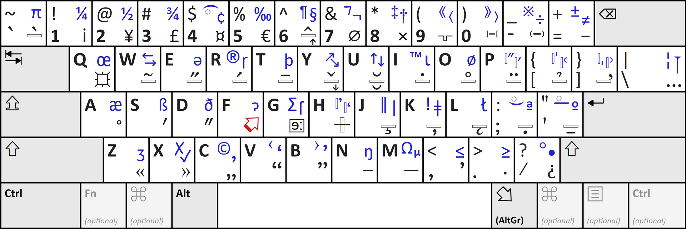
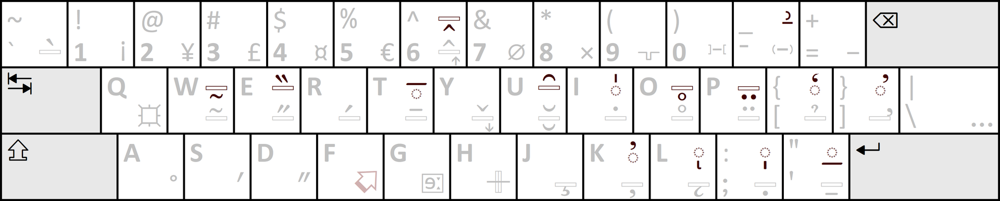

# xkb-latin-international
An xkb keymap for the ISO/IEC 9995-3:2026 Latin International keyboard layout.

The layout is a truly international layout, making it possible to type any language based on the Latin alphabet.
It also enables the convenient input of a large variety of symbols useful in typography, science and mathematics, and linguistics.
It shares some similarities with the [German extended keyboard layout](https://en.wikipedia.org/wiki/German_extended_keyboard_layout), but caters to a broader audience.

See [Wikipedia](https://en.wikipedia.org/wiki/Latin_International_keyboard_layout) for more information.

If you currently use the EurKEY layout, the Latin International layout may well appeal to you, just as it did to me.
For me, the most useful symbols missing from EurKey that are here *easily* accessible are a proper minus symbol, the section sign §, the diameter sign ⌀, true primes ′ and ″, bullets •◦, and daggers †‡, but I imagine there's something useful for everyone in there.

The standard defines several variants for different [physical key arrangements](https://en.wikipedia.org/wiki/ISO/IEC_9995#Key_arrangements).
Currently, this keymap only defines the "A" variant, which is the variant for ANSI keyboards (the "A" key arrangement); it also works well with the common "E" key arrangement (called the "ISO" arrangement prior to 2026, used by many European layouts e.g. UK, DE, FR).

## Installation

To make the layout usable for the current user:

1. Copy the keymap file (`symbols/iso`) to `$XDG_CONFIG_HOME/xkb/symbols/iso`

2. Copy the rules file (`rules/evdev.xml`) to `$XDG_CONFIG_HOME/xkb/rules/evdev.xml`, or append its contents to the current file if one already exists

3. Copy the Compose file (`Compose`) to `$HOME/.XCompose`

Restarting the session may be required to make the layout show up in the GUI settings menu of your DE.

To instead make the layout available system-wide, see https://xkbcommon.org/doc/current/custom-configuration.html#xkb-data-locations for the correct location.

## Usage

The image below is reproduced from the Wikipedia page for the layout (by Karl432 - Own work, CC BY 4.0, https://commons.wikimedia.org/w/index.php?curid=181180980).



For quick reference, the colours and positions of the characters on the keycaps correspond to the xkb "level" they are at and are produced as follows:

| Colour    | Position          | Level | Modifiers                         |
| ------    | --------          | ----- | ---------                         |
| Black     | bottom left       | 1     | none, normal key press            |
| Black     | top left          | 2     | <kbd>Shift</kbd>                  |
| Black     | bottom right      | 3     | <kbd>AltGr</kbd>                  |
| †         | †                 | 4     | <kbd>AltGr</kbd>+<kbd>Shift</kbd> |
| Blue      | top right         | 5     | <kbd>⬀</kbd>                      |
| Blue      | top right above   | 6     | <kbd>⬀</kbd>+<kbd>Shift</kbd>     |

† The 15 dead keys activated using <kbd>Shift</kbd>+<kbd>AltGr</kbd> are not shown on the keycaps

The exact identity of many of the symbols is discussed in more depth at https://en.wikipedia.org/wiki/Latin_International_keyboard_layout.

### Modifiers

To produce the various characters shown on the keycaps, the Latin International layout makes use of three modifiers:

1. <kbd>Shift</kbd>

2. <kbd>AltGr</kbd> (mapped to the right <kbd>Alt</kbd> key of an ANSI keyboard, which does not normally have <kbd>AltGr</kbd>)

3. The "**Extra Selector**" key <kbd>⬀</kbd>, which is switched on using <kbd>AltGr</kbd>+<kbd>F</kbd>

<kbd>Shift</kbd> and <kbd>AltGr</kbd> are held down like usual, while the Extra Selector functions like a dead key when activated using <kbd>AltGr</kbd>+<kbd>F</kbd>, in that it is a latch – it only needs to be pressed to be activated, not held down, and deactivates automatically after a character has been input.

### Special keys

The layout also features a couple of other special keys:

1. The "**Superselect**" key, indicated by the "square sun" symbol  or by 🌐, which is switched on using <kbd>AltGr</kbd>+<kbd>Q</kbd>

2. The "**IPA Special Selector**" key, indicated by the  symbol, which is switched on using <kbd>AltGr</kbd>+<kbd>G</kbd>

Both of these function like Compose keys: they are pressed to activate them (not held down) and a key sequence is then typed to specify a character.

### Producing characters

#### Normal letters, numbers, and symbols from the QWERTY layout

These are shown in **black** on the **left** of the keycaps.

If two characters are shown, the character in the lower left is the one normally produced, and the one in the upper left is produced when holding <kbd>Shift</kbd>.
If only a single character is shown (in the upper left corner), <kbd>Shift</kbd> is held in order to produce the uppercase variant.

#### Diacritic dead keys with <kbd>AltGr</kbd>

These are shown in **black** on the **right** of the keycaps and use a **hollow rectangle** (or dotted circle in some cases) to show the position of the diacritic relative to a character.
Most of the upper and middle letter rows are for diacritics.

They are implemented as dead keys – activate them by pressing the key with <kbd>AltGr</kbd>, then input the character the diacritic should be combined with.

Additionally, there are some dead keys that are related to the ones shown in the bottom right of certain keys that are produced by holding <kbd>AltGr</kbd>+<kbd>Shift</kbd>, but are unmarked on the layout image above; these are shown below:



For a full list of the dead keys, see the Wikipedia page or the table below.

#### Additional punctuation with <kbd>AltGr</kbd>

The other characters shown in **black** at the **bottom right** of the keycaps (those that do *not* feature a hollow rectangle) are mostly various common punctuation symbols, with a few currency symbols as well.
These mostly occupy the number row and lower letter row.

They are produced by pressing the key while holding <kbd>AltGr</kbd>.

#### Additional symbols with <kbd>⬀</kbd> or <kbd>⬀</kbd>+<kbd>Shift</kbd>

These are shown in **blue** at the **top right** of the keycaps.

Almost all of the keys  produce a different character when <kbd>Shift</kbd> is also held down as well as <kbd>⬀</kbd>.
If two characters are shown on the keycap, the character in blue on the right is the one produced with only <kbd>⬀</kbd>, and the one on the left (and slightly raised) is produced when additionally holding <kbd>Shift</kbd>.
If only a single character is shown, typically the character is a letter character, and pressing the key with the addition of <kbd>Shift</kbd> affords the uppercase variant.
In just a handful of cases (<kbd>¼</kbd>, <kbd>½</kbd>, <kbd>¾</kbd>, <kbd>‰</kbd>, <kbd>≤</kbd>, and <kbd>≥</kbd>) there is no alternative character mapped to the shifted combination.

### Adding additional Extra Selector and Superselect keys

I highly recommend remapping one of your other keys to work as a *shift-style* Extra Selector <kbd>⬀</kbd>, that you press and hold to access the level 5 and 6 symbols.
This makes it as easy to insert those symbols (in blue on the diagram) as those that require <kbd>AltGr</kbd>.
Personally, I have changed <kbd>CapsLock</kbd> to function in this way, as it is easy to hold down at the same time as <kbd>Shift</kbd>.

I also highly recommend remapping some key to work as an extra Superselect key, if you can spare one.
If you use a keyboard with an ISO key arrangement (e.g. the majority keyboards in Europe or for European languages) the <kbd><</kbd> key to the left of <kbd>Z</kbd> is unused when using the 

On KDE at least this is easy to do, under **System Settings > Keyboard > Key Bindings**.

## Implementation details

Note the following points:

- The "Superselect key" (<kbd>AltGr</kbd>+<kbd>Q</kbd>) is just mapped as `<Multi_key>`, so its behaviour is the same as any other Compose key. To have its behaviour match that laid out in the ISO standard, you must use the Compose file provided in this repo. (Note that it is a work in progress and only currently provides partial coverage of the standard.)

### Dead keys

The following dead keys are available in xkb, many of which are used by the layout:

| Dead key                  | Key combination                                   | Mapped keysym    | Notes |
| ------------------------- | ------------------------------------------------- | ------------- | ----- |
| `dead_grave`              | <kbd>AltGr</kbd>+<kbd>`</kbd>                     | `TLDE.3`      |       |
| `dead_currency`           | <kbd>AltGr</kbd>+<kbd>4</kbd>                     | `AE04.3`      |       |
| `dead_circumflex`         | <kbd>AltGr</kbd>+<kbd>6</kbd>                     | `AE06.3`      |       |
| `dead_belowcircumflex`    | <kbd>AltGr</kbd>+<kbd>Shift</kbd>+<kbd>6</kbd>    | `AE06.4`      |       |
| `dead_hamza`              | <kbd>AltGr</kbd>+<kbd>Shift</kbd>+<kbd>-</kbd>    | `AE11.4`      |       |
| `dead_tilde`              | <kbd>AltGr</kbd>+<kbd>W</kbd>                     | `AD02.3`      |       |
| `dead_belowtilde`         | <kbd>AltGr</kbd>+<kbd>Shift</kbd>+<kbd>W</kbd>    | `AD02.4`      |       |
| `dead_doubleacute`        | <kbd>AltGr</kbd>+<kbd>E</kbd>                     | `AD03.3`      |       |
| `dead_doublegrave`        | <kbd>AltGr</kbd>+<kbd>Shift</kbd>+<kbd>E</kbd>    | `AD03.4`      |       |
| `dead_acute`              | <kbd>AltGr</kbd>+<kbd>R</kbd>                     | `AD04.3`      |       |
| `dead_macron`             | <kbd>AltGr</kbd>+<kbd>T</kbd>                     | `AD05.3`      |       |
| `dead_longsolidusoverlay` | <kbd>AltGr</kbd>+<kbd>Shift</kbd>+<kbd>T</kbd>    | `AD05.4`      | Used as a dead overline |
| `dead_caron`              | <kbd>AltGr</kbd>+<kbd>Y</kbd>                     | `AD06.3`      |       |
| `dead_breve`              | <kbd>AltGr</kbd>+<kbd>U</kbd>                     | `AD07.3`      |       |
| `dead_invertedbreve`      | <kbd>AltGr</kbd>+<kbd>Shift</kbd>+<kbd>U</kbd>    | `AD07.4`      |       |
| `dead_abovedot`           | <kbd>AltGr</kbd>+<kbd>I</kbd>                     | `AD08.3`      |       |
| `dead_aboveverticalline`  | <kbd>AltGr</kbd>+<kbd>Shift</kbd>+<kbd>I</kbd>    | `AD08.4`      |       |
| `dead_abovering`          | <kbd>AltGr</kbd>+<kbd>O</kbd>                     | `AD09.3`      |       |
| `dead_belowring`          | <kbd>AltGr</kbd>+<kbd>Shift</kbd>+<kbd>O</kbd>    | `AD09.4`      |       |
| `dead_diaeresis`          | <kbd>AltGr</kbd>+<kbd>P</kbd>                     | `AD10.3`      |       |
| `dead_belowdiaeresis`     | <kbd>AltGr</kbd>+<kbd>Shift</kbd>+<kbd>P</kbd>    | `AD10.4`      |       |
| `dead_hook`               | <kbd>AltGr</kbd>+<kbd>[</kbd>                     | `AD11.3`      |       |
| `dead_abovereversedcomma` | <kbd>AltGr</kbd>+<kbd>Shift</kbd>+<kbd>[</kbd>    | `AD11.4`      |       |
| `dead_horn`               | <kbd>AltGr</kbd>+<kbd>]</kbd>                     | `AD12.3`      |       |
| `dead_schwa`              | <kbd>AltGr</kbd>+<kbd>G</kbd>                     | `AC05.3`      | Used as a dead IPA key |
| `dead_stroke`             | <kbd>AltGr</kbd>+<kbd>H</kbd>                     | `AC06.3`      |       |
| `dead_cedilla`            | <kbd>AltGr</kbd>+<kbd>J</kbd>                     | `AC07.3`      |       |
| `dead_belowcomma`         | <kbd>AltGr</kbd>+<kbd>K</kbd>                     | `AC08.3`      |       |
| `dead_abovecomma`         | <kbd>AltGr</kbd>+<kbd>Shift</kbd>+<kbd>K</kbd>    | `AC08.4`      |       |
| `dead_ogonek`             | <kbd>AltGr</kbd>+<kbd>L</kbd>                     | `AC09.3`      |       |
| `dead_belowbreve`         | <kbd>AltGr</kbd>+<kbd>Shift</kbd>+<kbd>L</kbd>    | `AC09.4`      | Used as a dead below open mark |
| `dead_belowdot`           | <kbd>AltGr</kbd>+<kbd>;</kbd>                     | `AC10.3`      |       |
| `dead_belowverticalline`  | <kbd>AltGr</kbd>+<kbd>Shift</kbd>+<kbd>;</kbd>    | `AC10.4`      |       |
| `dead_belowmacron`        | <kbd>AltGr</kbd>+<kbd>'</kbd>                     | `AC11.3`      |       |
| `dead_lowline`            | <kbd>AltGr</kbd>+<kbd>Shift</kbd>+<kbd>'</kbd>    | `AC11.4`      |       |
| `dead_iota`               | Not mapped                                        | Not mapped    |       |
| `dead_voiced_sound`       | Not mapped                                        | Not mapped    |       |
| `dead_semivoiced_sound`   | Not mapped                                        | Not mapped    |       |
| `dead_a`                  | Not mapped                                        | Not mapped    |       |
| `dead_A`                  | Not mapped                                        | Not mapped    |       |
| `dead_e`                  | Not mapped                                        | Not mapped    |       |
| `dead_E`                  | Not mapped                                        | Not mapped    |       |
| `dead_i`                  | Not mapped                                        | Not mapped    |       |
| `dead_I`                  | Not mapped                                        | Not mapped    |       |
| `dead_o`                  | Not mapped                                        | Not mapped    |       |
| `dead_O`                  | Not mapped                                        | Not mapped    |       |
| `dead_u`                  | Not mapped                                        | Not mapped    |       |
| `dead_U`                  | Not mapped                                        | Not mapped    |       |
| `dead_SCHWA`              | Not mapped                                        | Not mapped    |       |
| `dead_greek`              | Not mapped                                        | Not mapped    |       |
| `dead_perispomeni`        | Not mapped                                        | Not mapped    | Non-deprecated alias for `dead_tilde` |
| `dead_psili`              | Not mapped                                        | Not mapped    | Non-deprecated alias for `dead_abovecomma` |
| `dead_dasia`              | Not mapped                                        | Not mapped    | Non-deprecated alias for `dead_abovereversedcomma`  |
| `dead_small_schwa`        | Not mapped                                        | Not mapped    | Deprecated alias for `dead_schwa` |
| `dead_capital_schwa`      | Not mapped                                        | Not mapped    | Deprecated alias for `dead_SCHWA` |

## Known issues

### Missing dead keys

One issue is that there are a few dead keys that the standard requires but that do not
currently have definitions.

For now, these have been replaced as follows:

- `dead_ipa` -> `dead_schwa`
- `dead_overline` -> `dead_longsolidusoverlay`
- `dead_belowopenmark` -> `dead_belowbreve`
- `dead_aboverightcomma` -> `U0315`

### Deviations of Compose vs ISO standard

The initial dead key definitions (for basic letters only) were taken from the default Compose file for `en_US.UTF-8`.
It needs to be checked that these are the same as the mappings in the ISO standard.

In particular, the currency symbols are definitely not correct currently.

### Appropriateness of keysyms

I am unsure if the symbol on `<AE11.4>` is definitely meant to be mapped as `<dead_hamza>`.

## TODO

- Missing parts of Compose file
  - Missing diacritics
  - Missing superselect groups
  - IPA
- Upstream by opening issue at https://gitlab.freedesktop.org/xkeyboard-config/xkeyboard-config

## Contributing

Contributions via pull requests are welcome.

### Making changes

See https://xkbcommon.org/doc/current/custom-configuration.html for a guide to customizing the keyboard layout when using `libxkbcommon`.

### Testing

After making changes, you may wish to test the layout without it affecting the environment.

First ensure that the `libxkbcommon-tools` package (or whatever it is called on your distro) is installed.

To check the layout compiles, run:
```bash
xkbcli compile-keymap --include ./xkb-latin-international \
                      --include-defaults \
                      --test \
                      --layout iso \
&& echo "valid!" || echo "invalid!"
```

To test it interactively, run:
```bash
xkbcli compile-keymap --include ./xkb-latin-international \
                      --include-defaults \
                      --layout iso \
| xkbcli interactive
```
