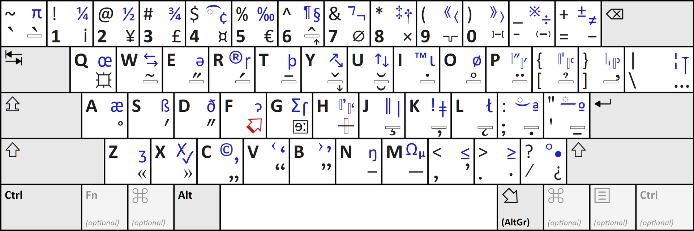
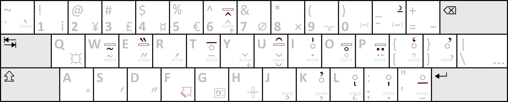

# xkb-latin-international
An xkb keymap for the ISO/IEC 9995-3:2026 Latin International keyboard layout.

The layout is a truly international layout, making it possible to type any language based on the Latin alphabet.
It also enables the convenient input of a large variety of symbols useful in typography, science and mathematics, and linguistics.
It shares some similarities with the [German extended keyboard layout](https://en.wikipedia.org/wiki/German_extended_keyboard_layout), but caters to a broader audience.

By using the xkb keymap in conjunction with the Compose file in this repository, it is possible to type over 1400 unique Unicode code points (using more than 1800 defined key sequences).

See [Wikipedia](https://en.wikipedia.org/wiki/Latin_International_keyboard_layout) for more information.

If you currently use the EurKEY layout, the Latin International layout may well appeal to you, just as it did to me.
For me, the most useful symbols missing from EurKey that are here *easily* accessible are a proper minus symbol, the section sign §, the diameter sign ⌀, true primes ′ and ″, bullets •◦, and daggers †‡, but I imagine there's something useful for everyone in there.

The standard defines several variants for different [physical key arrangements](https://en.wikipedia.org/wiki/ISO/IEC_9995#Key_arrangements).
Currently, this keymap only defines the "A" variant, which is the variant for ANSI keyboards (the "A" key arrangement); it also works well with the common "E" key arrangement (called the "ISO" arrangement prior to 2026, used by many European layouts e.g. UK, DE, FR).

## Installation

To make the layout usable for the current user:

1. Copy the keymap file (`symbols/iso`) to `$XDG_CONFIG_HOME/xkb/symbols/iso`

2. Copy the rules file (`rules/evdev.xml`) to `$XDG_CONFIG_HOME/xkb/rules/evdev.xml`, or append its contents to the current file if one already exists

3. Copy the Compose file (`Compose`) to `$HOME/.XCompose`

Restarting the session may be required to make the layout show up in the GUI settings menu of your DE.

To instead make the layout available system-wide, see https://xkbcommon.org/doc/current/custom-configuration.html#xkb-data-locations for the correct location.

## Usage

The image below is reproduced from the Wikipedia page for the layout (by Karl432 - Own work, CC BY 4.0, https://commons.wikimedia.org/w/index.php?curid=181180980).



For quick reference, the colours and positions of the characters on the keycaps correspond to the xkb "level" they are at and are produced as follows:

| Colour    | Position          | Level | Modifiers                         |
| ------    | --------          | ----- | ---------                         |
| Black     | bottom left       | 1     | none, normal key press            |
| Black     | top left          | 2     | `Shift`                  |
| Black     | bottom right      | 3     | `AltGr`                  |
| †         | †                 | 4     | `AltGr+Shift` |
| Blue      | top right         | 5     | `⬀`                      |
| Blue      | top right above   | 6     | `⬀+Shift`     |

† The 15 dead keys activated using `Shift+AltGr` are not shown on the keycaps

The exact identity of many of the symbols is discussed in more depth at https://en.wikipedia.org/wiki/Latin_International_keyboard_layout,
and a full map can be found in `characters.md`.

### Modifiers

To produce the various characters shown on the keycaps, the Latin International layout makes use of three modifiers:

1. `Shift`

2. `AltGr` (mapped to the right `Alt` key of an ANSI keyboard, which does not normally have `AltGr`)

3. The "**Extra Selector**" key `⬀`, which is switched on using `AltGr+F`

`Shift` and `AltGr` are held down like usual, while the Extra Selector functions like a dead key when activated using `AltGr+F`, in that it is a latch – it only needs to be pressed to be activated, not held down, and deactivates automatically after a character has been input.

### Special keys

The layout also features three other special keys:

1. The "**Superselect**" key, indicated by the "square sun" symbol  or by `🌐`, which is switched on using `AltGr+Q`

2. The "**IPA Special Selector**" key, indicated by the  symbol or by `ɘː`, which is switched on using `AltGr+G`

3. The dead-key-like "**Currency**" key, indicated by `¤`, which is switched on using `AltGr+4`

These function like Compose keys: they are pressed to activate them (not held down) and a key sequence is then typed to specify a character.

### Producing characters

#### Normal letters, numbers, and symbols from the QWERTY layout

These are shown in **black** on the **left** of the keycaps.

If two characters are shown, the character in the lower left is the one normally produced, and the one in the upper left is produced when holding `Shift`.
If only a single character is shown (in the upper left corner), `Shift` is held in order to produce the uppercase variant.

#### Additional punctuation with `AltGr`

These are shown in **black** on the **right** of the keycaps (those that do *not* feature a hollow rectangle).
These mostly occupy the number row and lower letter row.
They are produced by pressing the key while holding `AltGr`.

These characters are all common punctuation symbols as required for proper typography: the degree symbol, the diameter sign, proper minus and multiplication signs, the ellipsis, en- and em-dashes, inverted question and exclamation marks, true (curly) apostrophes and quotation marks, quotation marks as used in various languages, primes, bullets.

This also includes four special characters for spacing and hyphenation:
- `AltGr+Space` gives a no-break space
- `AltGr+9` gives a *narrow* no-break space
- `AltGr+0` gives a non-breaking hyphen
- `AltGr+-` gives a soft hyphen (i.e. to indicate where breaking across lines *should* occur in a word)

Additionally, three common currency symbols can be input via this mechanism: ¥, £, and €, on `2`, `3`, and `5` respectively.
`AltGr+4` is the currency dead key, allowing access to even more.

#### Diacritic dead keys with `AltGr`

These are shown in **black** on the **right** of the keycaps and use a **hollow rectangle** to show the position of the diacritic relative to a character.
Most of the upper and middle letter rows are for diacritics.

They are implemented as dead keys – activate them by pressing the key with `AltGr`, then input the character the diacritic should be combined with.

Not all combinations of base character + diacritic have pre-composed combinations.
To insert a combining version of the diacritic so that it can be used with any character, press the dead key twice in a row.
Remember that when adding a diacritic to a base character in this way, the combining diacritic should come *after* the base character, and should therefore be input after, not before as when using a dead key.

Spacing (i.e. standalone, non-combining) versions of the diacritics can be input by pressing the dead key followed by a space.

Some diacritic dead keys have slightly variable behaviour depending on the following character.
In particular, three are indicated on the keycaps in the diagram:
- Pressing the circumflex dead key `AltGr+6` followed by a digit, parenthensis, plus, or hyphen-minus results in a **superscript** version
- Pressing the caron dead key `AltGr+Y` followed by a digit, parenthensis, plus, or hyphen-minus results in a **subscript** version
- The breve dead key `AltGr+U` usually adds a breve *above* the character, except with `H` and `h`, where it is added *below*

See the Wikipedia page for the small handful of [other characters that can be entered using the dead keys](https://en.wikipedia.org/wiki/Latin_International_keyboard_layout#Other_characters_which_can_be_entered_by_dead_keys).

#### Additional diacritic dead keys with `AltGr+Shift`

As well as the dead keys shown on the diagram, the addition of `Shift` while pressing a dead key in some cases results in a further related dead key.
For example:
- `AltGr+W` is the dead key for a tilde *above*, `AltGr+Shift+W` is the dead key for a tilde *below*
- `AltGr+E` is the dead key for a double *acute* accent, `AltGr+Shift+E` is the dead key for a double *grave* accent

These additional dead keys are unmarked on the layout image above; they are shown below (the ones with hollow rectangles):



For a full list of the dead keys, see the table below.

#### Combining diacritics with `AltGr+Shift`

Those characters on the additional diagram above that use a **hollow dashed circle** to show the position of the diacritic relative to a character are *not* dead keys.
Pressing them results in the respective "combining" diacritic character.

For example, `AltGr+T` corresponds to a macron *dead key*, but `AltGr+Shift+T` corresponds directly to U+0305 COMBINING OVERLINE.

Note that two of these diacritics are not even shown on the additional diagram above:
`AltGr+Shift` with `,` or `.` give U+1DFE COMBINING LEFT ARROWHEAD ABOVE and U+0350 COMBINING RIGHT ARROWHEAD ABOVE respectively.

#### Additional symbols with `⬀` or `⬀+Shift`

These are shown in **blue** at the **top right** of the keycaps.

Almost all of the keys  produce a different character when `Shift` is also held down as well as `⬀`.
If two characters are shown on the keycap, the character in blue on the right is the one produced with only `⬀`, and the one on the left (and slightly raised) is produced when additionally holding `Shift`.
If only a single character is shown, typically the character is a letter character, and pressing the key with the addition of `Shift` affords the uppercase variant.
In just a handful of cases (`¼`, `½`, `¾`, `‰`, `≤`, and `≥`) there is no alternative character mapped to the shifted combination.

#### Combining double diacritics with `⬀` or `⬀+Shift`

Three of the characters in **blue** feature a **hollow dashed circle** (on `4`, `;`, and `'`) – these keys produce the respective combining double diacritic character.
These special double diacritics are entered between two other characters, and will span across both the preceding and following characters.

### Adding additional Extra Selector and Superselect keys

I highly recommend remapping one of your other keys to work as a *shift-style* Extra Selector `⬀`, that you press and hold to access the level 5 and 6 symbols.
This makes it as easy to insert those symbols (in blue on the diagram) as those that require `AltGr`.
Personally, I have changed `CapsLock` to function in this way, as it is easy to hold down at the same time as `Shift`.

I also highly recommend remapping some key to work as an extra Superselect key, if you can spare one.
On KDE at least this is easy to do, under **System Settings > Keyboard > Key Bindings**.

If you use a keyboard with an ISO key arrangement (e.g. the majority keyboards in Europe or for European languages) the `<` key to the left of `Z` is unused and makes a good candidate for this.

## Implementation details

Note the following points:

- The "Superselect key" (`AltGr+Q`) is just mapped as `<Multi_key>`, so its behaviour is the same as any other Compose key.
- To have its behaviour match that laid out in the ISO standard, you must use the Compose file provided in this repo. (Note that it is a work in progress and only currently provides partial coverage of the standard.)

## Reference

### Special characters

Substitutes are shown here for whitespace characters according to https://en.wikipedia.org/wiki/Whitespace_character#Substitute_images.

| Key     | `AltGr`                 | `⬀`       | `⬀+Shift` |
| ------- | ----------------------- | --------- | ---------- |
| `~`     |                         | π         | ∏          |
| `1`     | ¡                       | ¼         |            |
| `2`     | ¥                       | ½         |            |
| `3`     | £                       | ¾         |            |
| `4`     |                         | ¢         |            |
| `5`     | €                       | ‰         |            |
| `6`     |                         | ‰         | ¶          |
| `7`     | ⌀                       | ¬         | ⁊          |
| `8`     | ×                       | †         | ‡          |
| `9`     | ⍽ (narrow nbsp)         | ⟨         | 《          |
| `0`     | ‑ (non-breaking hyphen) | ⟩         | 》          |
| `-`     |   (soft hyphen)         | ÷         | ※          |
| `=`     | −                       | ≠         | ±          |
|         |                         |           |            |
| `Q`     |                         | œ         | Œ          |
| `W`     |                         | →         | ←          |
| `E`     |                         | ə         | Ə          |
| `R`     |                         | ɼ         | ®          |
| `T`     |                         | þ         | Þ          |
| `Y`     |                         | ↘         | ↗          |
| `U`     |                         | ↓         | ↑          |
| `I`     |                         | ı         | ™          |
| `O`     |                         | ø         | Ø          |
| `P`     |                         |           |            |
| `[`     |                         |           |            |
| `]`     |                         |           |            |
| `\`     | …                       | (zwnj)    | ¦          |
|         |                         |           |            |
| `A`     | °                       | æ         | Æ          |
| `S`     | ′                       | ß         | ẞ          |
| `D`     | ″                       | ð         | Ð          |
| `F`     |                         | ɂ         | Ɂ          |
| `G`     |                         | ſ         | ∑          |
| `H`     |                         |           |            |
| `J`     |                         | ǀ         | ǁ          |
| `K`     |                         | ǂ         | ǃ          |
| `L`     |                         | ł         | Ł          |
| `;`     |                         | ª         |            |
| `'`     |                         | º         |            |
|         |                         |           |            |
| `Z`     | «                       | ʒ         | Ʒ          |
| `X`     | »                       | ✓         | ✗          |
| `C`     | „                       | ‚         | ©          |
| `V`     | “                       | ‘         | ‹          |
| `B`     | ”                       | ’         | ›          |
| `N`     | –                       | ƞ         | Ƞ          |
| `M`     | —                       | μ         | Ω          |
| `,`     | '                       | ≤         | ≪          |
| `.`     | ·                       | ≥         | ≫          |
| `/`     | ¿                       | •         | ◦          |
|         |                         |           |            |
| `Space` | ⍽ (nbsp)                | ␣ (space) | ␣ (space)  |

### Dead keys

These combinations do not produce characters directly;
instead, the character produced depends on the next key press.

The corresponding combining diacritics are shown here combined with a dotted circle ◌.

| Key     | `AltGr`                           | `AltGr+Shift`        |
| ------- | --------------------------------- | -------------------- |
| `~`     | ◌̀  (grave)                        |                      |
| `6`     | ◌̂  (circumflex, **superscripts**) | ◌̭ (circumflex below) |
| `W`     | ◌̃  (tilde)                        | ◌̰  (tilde below)     |
| `E`     | ◌̋  (double acute)                 | ◌̏  (double grave)    |
| `R`     | ◌́  (acute)                        |                      |
| `T`     | ◌̄  (macron)                       |                      |
| `Y`     | ◌̌  (caron, **subscripts**)        |                      |
| `U`     | ◌̆  (breve)                        | ◌̑  (inverted breve)  |
| `I`     | ◌̇  (dot above)                    |                      |
| `O`     | ◌̊  (ring above)                   | ◌̥  (ring below)      |
| `P`     | ◌̈  (diaeresis)                    | ◌̤  (diaeresis below) |
| `[`     | ◌̉  (hook above)                   |                      |
| `]`     | ◌̛  (horn)                         |                      |
| `H`     | ◌̶  (stroke)                       |                      |
| `J`     | ◌̧  (cedilla)                      |                      |
| `K`     | ◌̦  (comma below)                  |                      |
| `L`     | ◌̨  (ogonek)                       |                      |
| `;`     | ◌̣  (dot below)                    |                      |
| `'`     | ◌̱  (macron below)                 |                      |

### Combining diacritics

These are not dead keys -- the characters are produced immediately.

Note that, in contrast to the way dead keys are used, these characters combine with the *preceding* character.

The combining diacritics are shown here combined with a dotted circle ◌.

| Key     | `AltGr+Shift`              | `⬀+Shift` (double marks)   |
| ------- | -------------------------- | -------------------------- |
| `4`     |                            | ◌͡◌ (double inverted breve) |
| `T`     | ◌̅  (overline)              |                            |
| `I`     | ◌̍  (vertical line above)   |                            |
| `[`     | ◌̒  (turned comma above)    |                            |
| `]`     | ◌̕  (comma above right)     |                            |
| `K`     | ◌̓  (comma above)           |                            |
| `L`     | ◌᪷  (open mark below)       |                            |
| `;`     | ◌̩  (vertical line below)   | ◌͜◌ (double breve below)    |
| `'`     | ◌̲  (low line)              | ◌͟◌ (double macron below)   |
| `,`     | ◌᷾  (left arrowhead above)  |                            |
| `.`     | ◌͐  (right arrowhead above) |                            |

### Modifier letters

These are likewise not dead keys -- the characters are produced immediately.

The modifier letters are shown here with a preceding x for demonstration purposes, but do not need to be next to another character (unlike combining diacritics).

| Key     | `⬀`                    | `⬀+Shift`            |
| ------- | ---------------------- | --------------------- |
| `P`     | xʹ (prime)             | xʺ (double prime)     |
| `[`     | xˈ (vertical line)     | xʿ (left half ring)   |
| `]`     | xˌ (low vertical line) | xʾ (right half ring)  |
| `H`     | xʻ (turned comma)      | xʼ (apostrophe)       |

### Overall


| Key     | `AltGr`                                             | `AltGr+Shift`                           | `⬀`                                         | `⬀+Shift`                                 |
| ------- | --------------------------------------------------- | --------------------------------------- | ------------------------------------------- | ------------------------------------------ |
| `~`     | ◌̀  *dead grave*                                     |                                         | U+03C0 π GREEK SMALL LETTER PI              | U+220F ∏ N_ARY PRODUCT                     |
| `1`     | U+00A1 ¡ INVERTED EXCLAMATION MARK                  |                                         | U+00BC ¼ VULGAR FRACTION ONE QUARTER        |                                            |
| `2`     | U+00A5 ¥ YEN SIGN                                   |                                         | U+00BD ½ VULGAR FRACTION ONE HALF           |                                            |
| `3`     | U+00A3 £ POUND SIGN                                 |                                         | U+00BE ¾ VULGAR FRACTION THREE QUARTERS     |                                            |
| `4`     | `¤` (*Currency*)                                    |                                         | U+00A2 ¢ CENT SIGN                          | U+0361 ◌͡◌ COMBINING DOUBLE INVERTED BREVE  |
| `5`     | U+20AC € EURO SIGN                                  |                                         | U+2030 ‰ PER MILLE SIGN                     |                                            |
| `6`     | ◌̂  *dead circumflex, **superscripts***              | ◌̭ *dead circumflex below*               | U+00A7 ‰ SECTION SIGN                       | U+00B6 ¶ PILCROW SIGN                      |
| `7`     | U+2300 ⌀ DIAMETER SIGN                              |                                         | U+00AC ¬ NOT SIGN                           | U+204A ⁊ TIRONIAN SIGN ET                  |
| `8`     | U+00D7 × MULTIPLICATION SIGN                        |                                         | U+2020 † DAGGER                             | U+2021 ‡ DOUBLE DAGGER                     |
| `9`     | U+202F ⍽ NARROW NO-BREAK SPACE                      |                                         | U+2329 ⟨ LEFT-POINTING ANGLE BRACKET        | U+300A 《 LEFT DOUBLE ANGLE BRACKET         |
| `0`     | U+2011 ‑ NON-BREAKING HYPHEN                        |                                         | U+232A ⟩ RIGHT-POINTING ANGLE BRACKET       | U+300B 》 RIGHT DOUBLE ANGLE BRACKET        |
| `-`     | U+00AD   SOFT HYPHEN                                | (???)                                   | U+00F7 ÷ DIVISION SIGN                      | U+203B ※ REFERENCE MARK                    |
| `=`     | U+2212 − MINUS SIGN                                 |                                         | U+2260 ≠ NOT EQUAL TO                       | U+00B1 ± PLUS-MINUS SIGN                   |
|         |                                                     |                                         |                                             |                                            |
| `Q`     | `🌐` (Superselect)                                  |                                         | U+0153 œ LATIN SMALL LIGATURE OE            | U+0152 Œ LATIN CAPITAL LIGATURE OE         |
| `W`     | ◌̃  *dead tilde*                                     | ◌̰  *dead tilde below*                   | U+2192 → RIGHTWARDS ARROW                   | U+2190 ← LEFTWARDS ARROW                   |
| `E`     | ◌̋  *dead double acute*                              | ◌̏  *dead double grave*                  | U+0259 ə LATIN SMALL LETTER SCHWA           | U+018F Ə LATIN CAPITAL LETTER SCHWA        |
| `R`     | ◌́  *dead acute*                                     |                                         | U+027C ɼ LATIN SMALL LETTER R WITH LONG LEG | U+00AE ® REGISTERED SIGN                   |
| `T`     | ◌̄  *dead macron*                                    | U+0305 ◌̅  COMBINING OVERLINE            | U+00FE þ LATIN SMALL LETTER THORN           | U+00DE Þ LATIN CAPITAL LETTER THORN        |
| `Y`     | ◌̌  *dead caron, **subscripts***                     |                                         | U+2198 ↘ SOUTH EAST ARROW                   | U+2197 ↗ NORTH EAST ARROW                  |
| `U`     | ◌̆  *dead breve*                                     | ◌̑  *dead inverted breve*                | U+2193 ↓ DOWNWARDS ARROW                    | U+2191 ↑ UPWARDS ARROW                     |
| `I`     | ◌̇  *dead dot above*                                 | U+030D ◌̍  COMBINING VERTICAL LINE ABOVE | U+0131 ı LATIN SMALL LETTER DOTLESS I       | U+2122 ™ TRADE MARK SIGN                   |
| `O`     | ◌̊  *dead ring above*                                | ◌̥  *dead ring below*                    | U+00F8 ø LATIN SMALL LETTER O WITH STROKE   | U+00D8 Ø LATIN CAPITAL LETTER O WITH STROKE |
| `P`     | ◌̈  *dead diaeresis*                                 | ◌̤  *dead diaeresis below*               | U+02B9 xʹ MODIFIER LETTER PRIME             | U+02BA xʺ MODIFIER LETTER DOUBLE PRIME      |
| `[`     | ◌̉  *dead hook above*                                | U+0312 ◌̒  COMBINING TURNED COMMA ABOVE  | U+02C8 xˈ MODIFIER LETTER VERTICAL LINE     | U+02BF xʿ MODIFIER LETTER LEFT HALF RING    |
| `]`     | ◌̛  *dead horn*                                      | U+0315 ◌̕  COMBINING COMMA ABOVE RIGHT   | U+02CC xˌ MODIFIER LETTER LOW VERTICAL LINE | U+02BE xʾ MODIFIER LETTER RIGHT HALF RING   |
| `\`     | U+2026 … HORIZONTAL ELLIPSIS                        |                                         | U+200C   ZERO WIDTH NON-JOINER              | U+00A6 ¦ BROKEN BAR                        |
|         |                                                     |                                         |                                             |                                            |
| `A`     | U+00B0 ° DEGREE SIGN                                |                                         | U+00E6 æ LATIN SMALL LETTER AE              | U+00C6 Æ LATIN CAPITAL LETTER AE           |
| `S`     | U+2032 ′ PRIME                                      |                                         | U+00DF ß LATIN SMALL LETTER SHARP S         | U+1E9E ẞ LATIN CAPITAL LETTER SHARP S      |
| `D`     | U+2033 ″ DOUBLE PRIME                               |                                         | U+00F0 ð LATIN SMALL LETTER ETH             | U+00D0 Ð LATIN CAPITAL LETTER ETH          |
| `F`     | `⬀` (Extra Selector)                               |                                         | U+0242 ɂ LATIN SMALL LETTER GLOTTAL STOP     | U+0241 Ɂ LATIN CAPITAL LETTER GLOTTAL STOP |
| `G`     | `ɘː` (*IPA Special Selector*)                       |                                         | U+017F ſ LATIN SMALL LETTER LONG S          | U+2211 ∑ N-ARY SUMMATION                   |
| `H`     | ◌̶  *dead stroke*                                    |                                         | U+02BB xʻ MODIFIER LETTER TURNED COMMA      | U+02BC xʼ MODIFIER LETTER APOSTROPHE          |
| `J`     | ◌̧  *dead cedilla*                                   |                                         | U+01C0 ǀ LATIN LETTER DENTAL CLICK          | U+01C1 ǁ LATIN LETTER LATERAL CLICK         |
| `K`     | ◌̦  *dead comma below*                               | U+0313 ◌̓  COMBINING COMMA ABOVE         | U+01C2 ǂ LATIN LETTER ALVEOLAR CLICK        | U+01C3 ǃ LATIN LETTER RETROFLEX CLICK       |
| `L`     | ◌̨  *dead ogonek*                                    | U+1AB7 ◌᪷  COMBINING OPEN MARK BELOW     | U+0142 ł LATIN SMALL LETTER L WITH STROKE   | U+0141 Ł LATIN CAPITAL LETTER L WITH STROKE |
| `;`     | ◌̣  *dead dot below*                                 | U+0329 ◌̩  COMBINING VERTICAL LINE BELOW | U+00AA ª FEMININE ORDINAL INDICATOR         | U+035C ◌͜◌ COMBINING DOUBLE BREVE BELOW      |
| `'`     | ◌̱  *dead macron below*                              | U+0332 ◌̲  COMBINING LOW LINE            | U+00BA º MASCULINE ORDINAL INDICATOR        | U+035F ◌͟◌ COMBINING DOUBLE MACRON BELOW     |
|         |                                                     |                                         |                                             |                                            |
| `Z`     | U+00AB « LEFT-POINTING DOUBLE ANGLE QUOTATION MARK  |                                         | U+0292 ʒ LATIN SMALL LETTER EZH             | U+01B7 Ʒ LATIN CAPITAL LETTER EZH          |
| `X`     | U+00BB » RIGHT-POINTING DOUBLE ANGLE QUOTATION MARK |                                         | U+2713 ✓ CHECK MARK                         | U+2717 ✗ BALLOT X                          |
| `C`     | U+201E „ DOUBLE LOW-9 QUOTATION MARK                |                                         | U+201A ‚ SINGLE LOW-9 QUOTATION MARK        | U+00A9 © COPYRIGHT SIGN                    |
| `V`     | U+201C “ LEFT DOUBLE QUOTATION MARK                 |                                         | U+2018 ‘ LEFT SINGLE QUOTATION MARK         | U+2039 ‹ SINGLE LEFT-POINTING ANGLE QUOTATION MARK |
| `B`     | U+201D ” RIGHT DOUBLE QUOTATION MARK                |                                         | U+2019 ’ RIGHT SINGLE QUOTATION MARK        | U+203A › SINGLE RIGHT-POINTING ANGLE QUOTATION MARK |
| `N`     | U+2013 – EN DASH                                    |                                         | U+019E ƞ LATIN SMALL LETTER N WITH LONG RIGHT LEG | U+0220 Ƞ LATIN CAPITAL LETTER N WITH LONG RIGHT LEG |
| `M`     | U+2014 — EM DASH                                    |                                         | U+03BC μ GREEK SMALL LETTER MU              | U+03A9 Ω GREEK CAPITAL LETTER OMEGA        |
| `,`     | U+0027 ' APOSTROPHE                                 | U+1DFE ◌᷾ COMBINING LEFT ARROWHEAD ABOVE | U+2264 ≤ LESS-THAN OR EQUAL TO              | U+226A ≪ MUCH LESS-THAN                    |
| `.`     | U+00B7 · MIDDLE DOT                                 | U+0350 ◌͐ COMBINING RIGHT ARROWHEAD ABOVE| U+2265 ≥ GREATER-THAN OR EQUAL TO           | U+226B ≫ MUCH GREATER-THAN                 |
| `/`     | U+00BF ¿ INVERTED QUESTION MARK                     |                                         | U+2022 • BULLET                             | U+25E6 ◦ WHITE BULLET                      |
|         |                                                     |                                         |                                             |                                            |
| `Space` | U+00A0 ⍽ NO-BREAK SPACE                             | U+0020 ␣ SPACE                          | U+0020 ␣ SPACE                              | U+0020 ␣ SPACE                             |

### Full keymap

`characters.md` lists all Unicode code points that can be entered using the combination of the keymap and the Compose file.

## Known issues & open questions

### Missing dead key for IPA

There is currently no xkb `dead_ipa` key, so the otherwise-unused `dead_schwa` has been appropriated as an IPA dead key.
This is not ideal and a dedicated key would be better.

### Deviations of Compose vs ISO standard

The initial diacritic dead key mapping (for basic letters only) was taken from the default Compose file for `en_US.UTF-8`.
It needs to be checked that these are the same as the mappings in the ISO standard.

### Appropriateness of keysyms

`` ⬀+` `` produces π.
`` ⬀+Shift+` `` could in theory produce capital pi.
What is needed in mathematics is not the normal capital pi character, however, but rather the capital pi used as the product symbol.
Since the sum symbol U+2211 ∑ N-ARY SUMMATION is on `⬀+Shift+G`,
it seems sensible that `` ⬀+Shift+` `` should produce U+220F ∏ N_ARY PRODUCT.

### TODO

- Correct diacritic dead keys to match ISO rather than default `en_US.UTF-8.Compose` file. In particular need to:
  - map a dead key followed by space to the spacing variants
  - map a repeated press of a dead key to the corresponding combining character variants
  - map sequences that don't have pre-composed Unicode characters to the input base letter followed by the combining character
  - map chained dead keys to pre-composed characters when they exist
- Upstream by opening issue at https://gitlab.freedesktop.org/xkeyboard-config/xkeyboard-config

## Contributing

Contributions via pull requests are welcome.

### Making changes

See https://xkbcommon.org/doc/current/custom-configuration.html for a guide to customizing the keyboard layout when using `libxkbcommon`.

### Testing

After making changes, you may wish to test the layout without it affecting the environment.

First ensure that the `libxkbcommon-tools` package (or whatever it is called on your distro) is installed.

To check the layout compiles, run:
```bash
xkbcli compile-keymap --include ./xkb-latin-international \
                      --include-defaults \
                      --test \
                      --layout iso \
&& echo "valid!" || echo "invalid!"
```

To test it interactively, run:
```bash
xkbcli compile-keymap --include ./xkb-latin-international \
                      --include-defaults \
                      --layout iso \
| xkbcli interactive
```
